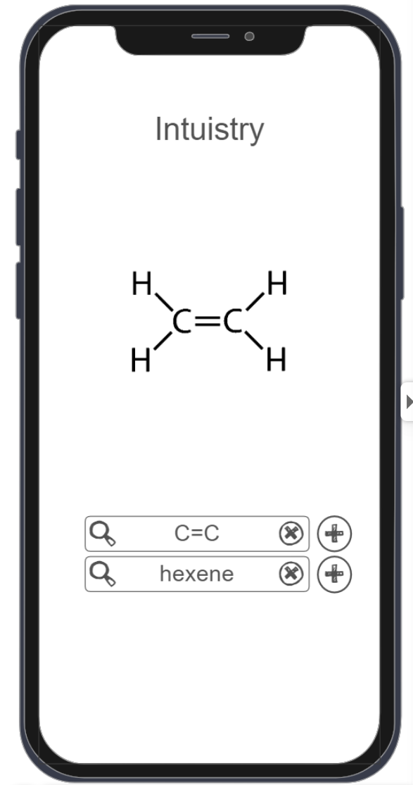

# Intuistry

## Specification Deliverable

### Elevator pitch

Intuistry is designed to help beginner computational chemists and cheminformatists familiarize with the variety of modes that chemical data is stored. In order to effectively do computational research with chemical data, there needs to be a basic understanding of the way that molecules can be represented. While this usually requires hours sifting through documentation and literature, Intuistry is a bridge to building this understanding in a natural and fun way. You can easily manipulate SMILES strings and chemical nomenclature, visualizing how they represent chemical data in real time.

### Design

### Key features

- Secure login over HTTPS to save projects
- Type in SMILES strings and see visual representation of molecule in real time 
- Type in chemical nomenclature and see visual representation of molecule in real time
- Copy strings to clipboard
- Options to change how molecule is visualized
- Select starting molecule from a group of templates
- Quizlet-style guessing of a molecule's SMILES string
- Saves previous strings from device

### Technologies

I am going to use the required technologies in the following ways.

- **HTML** - Uses correct HTML structure for application. Four HTML pages. One for login, one for drawing, one for selecting templates, and one for settings.
- **CSS** - Application styling that looks good on different screen sizes, uses good whitespace, color choice and contrast.
- **React** - Provides login, entering input strings, selecting templates, displaying visual representation, and use of React for routing and components.
- **Service** - Backend service with endpoints for:
  - login
  - modifying string
  - saving strings to account
  - retrieving account saves
- **DB/Login** - Store users, user profiles, and templates in database. Register and login users. Credentials securely stored in database. Can't save strings unless authenticated.
- **WebSocket** - As new templates are uploaded by an admin, users are notified in real time.
